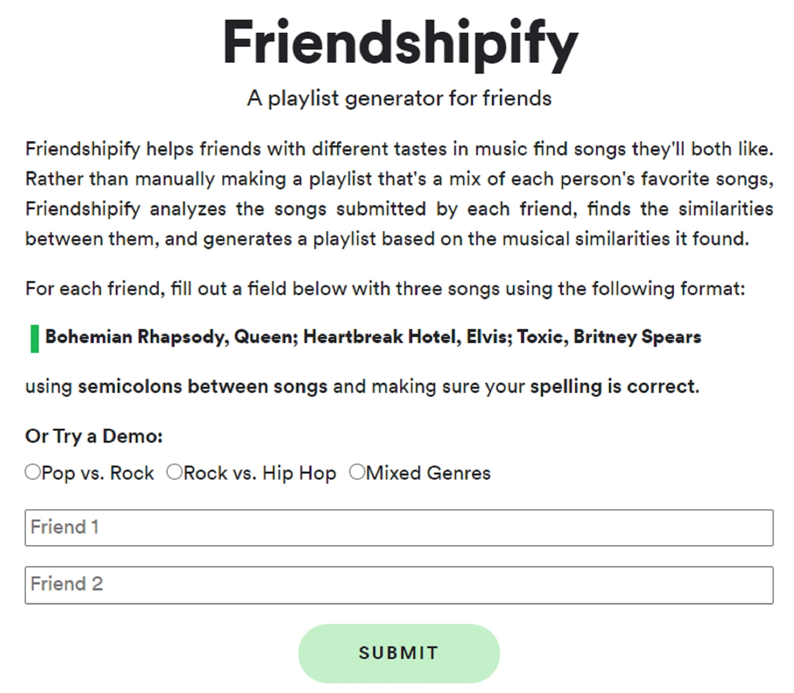

<!-- # Adventures in Data -->
<h1 styles="margin-top: 0px;">Adventures in Data</h1>

---
## Analyzing Music by Decade
I perform an exploratory anlysis on singles that went 
number one on the Billboard Hot 100 Chart from the 1950s to present.

    <a href="https://github.com/d-alvear/Analyzing-Music-by-Decade/blob/main/reports/project-writeup.md" target="_blank" rel="noopener noreferrer" style="text-decoration: none;">
        <button>
            Read More
        </button>
    </a>

--

## Friendshipify: A Playlist Generator For Friends 

A multi-user song recommender for friends, couples, or strangers with different tastes in music.
Friendshipify will recommend songs based on the similarities between two users' tastes.

    <a href="https://medium.com/towards-data-science/friendshipify-a-playlist-generator-for-friends-f79297f08b03" target="_blank" rel="noopener noreferrer" style="text-decoration: none;">
        <button>
            Read more
        </button>
    </a>

<!-- 
## Around the Internet

- [Project 1 Title](http://example.com/)
- [Project 2 Title](http://example.com/)
- [Project 3 Title](http://example.com/)
- [Project 4 Title](http://example.com/)
- [Project 5 Title](http://example.com/) -->

<!-- 
Page template forked from <a href="https://github.com/evanca/quick-portfolio">evanca</a>
 -->
<!-- Remove above link if you don't want to attibute -->
